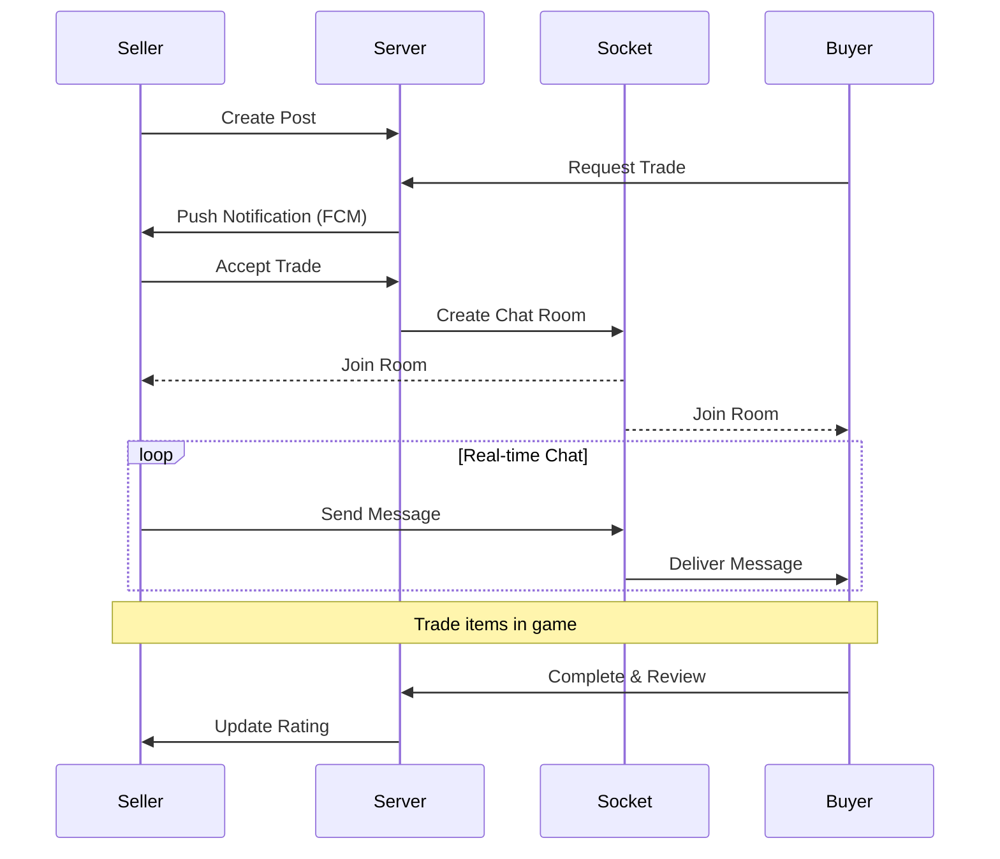

# Trade With Animalcrossing

> Cross-platform trading app for Animal Crossing players built with Vue.js & Ionic


## Features
- Real-time chat with Socket.io
- Post creation with image upload (AWS S3)
- Like/Dislike & Rating review system
- Push notifications (Firebase Cloud Messaging)
- Cross-platform support (Web, Android, iOS)

## Tech Stack
**Frontend:** Vue.js · Ionic · Vuex · Axios · Socket.io

**Mobile:** Capacitor (Android/iOS)

**Cloud:** AWS S3 · Firebase Cloud Messaging

## Architecture
```
Client (Vue.js + Ionic)
    │
    ├── REST API (Axios) ──→ Node.js Server
    │
    └── WebSocket (Socket.io) ──→ Real-time Chat
                                      │
                              ┌───────┴───────┐
                              ↓               ↓
                           AWS S3          FCM Push
                        (Image Storage)  (Notifications)
```

## Trade Process


## Related Repository
- **Backend:** [Node.js-project-AnimalCrossing](https://github.com/hyunnnn98/Node.js-project-AnimalCrossing)

## Release
- **Google Play Store:** Released (2020.06)

## Contributing
Issues and PRs are welcome.
